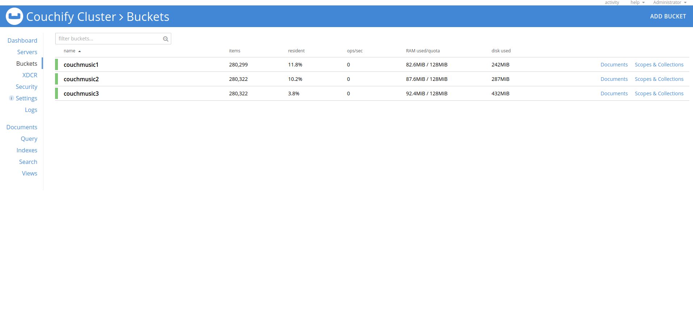

# Couchbase Simple Web Service


# Note
This simple project is based on this <a href="http://e-learning-labs.s3-website-us-west-2.amazonaws.com/cb130cs-lab-instructions/index.html">couchbase lab</a>.

## What I used
* Couchbase Client
* FluentAssertions
* Xunit

## Preliminary Setup if you want use a docker image

NB: if you under Ubuntu, most probably, you have to use **sudo** for each docker command. We have used: **Docker version: 20.10.17** and **bash version: 4.4.20**.

1. Download and run couchbase docker image
```
docker run -d --name couchmusic -p 8091-8096:8091-8096 \
-p 11210-11211:11210-11211 \
registry.gitlab.com/couchbasesamples/couchbase-training:1.5
```

3. Once container is created, take note its CONTAINER ID, in this example: *625ac7047fd3*
```
docker container ls

CONTAINER ID   IMAGE                                                         COMMAND                  CREATED          STATUS          PORTS                                                                                                                                                              NAMES
625ac7047fd3   registry.gitlab.com/couchbasesamples/couchbase-training:1.5   "/entrypoint.sh couc…"   8 seconds ago   Up 6 seconds   0.0.0.0:8091-8096->8091-8096/tcp, :::8091-8096->8091-8096/tcp, 11207/tcp, 0.0.0.0:11210-11211->11210-11211/tcp, :::11210-11211->11210-11211/tcp, 18091-18096/tcp   couchmusic
```

3. Go to *CouchbaseSimpleAPI/src* folder and copy script folder into container
```
docker cp script/ 625ac7047fd3:/script/
```

4. Enter in bash mode
```
docker exec -t -i 625ac7047fd3 /bin/bash
```

5. Run the script (Please wait! 'cause it would take a while!)
```
./script/runme.sh
```

7. Once it has terminated, press **ctrl-p and ctrl-q** and go to *couchbase web console main page*
```
http://localhost:8091/ui/index.html
```

8. Insert "Administrator" + "password" and check if all is properly created.




Last thing: before doing anything, wait for all the buckets to be green and available!

##  TO DO:
* Complete APIs
* Add more tests


## License
[](https://lbesson.mit-license.org/)

This project is licensed under the MIT License - see the [LICENSE](LICENSE) file for details

<hr>

## Connect with me
<p align="left">
<a href="https://www.linkedin.com/in/francescopl/" target="blank"></a>
<a href="https://www.kaggle.com/francescopaolol" target="blank"></a>
</p>


